# Performance Optimization Test Execution Plan

## Executive Summary
This document provides a comprehensive, step-by-step execution plan for validating the performance optimizations implemented in the Ryokushen Financial application. The plan prioritizes critical functionality while ensuring thorough coverage of all optimization areas.

---

## 1. Test Execution Priority Matrix

### **P0 - Critical Path Tests (MUST PASS BEFORE RELEASE)**
*These tests verify core functionality and data integrity*

| Test ID | Test Name | Area | Estimated Time | Dependency |
|---------|-----------|------|---------------|------------|
| DI-001 | Index Creation Performance | Data Index | 15 min | None |
| DI-002 | Lookup Performance vs Linear Search | Data Index | 20 min | DI-001 |
| FU-001 | Form Data Extraction | Form Utils | 10 min | None |
| FU-002 | Form Population | Form Utils | 10 min | FU-001 |
| CO-001 | Chart Creation Performance | Charts | 15 min | None |
| SR-006 | Full Application Rendering Performance | Smart Rendering | 30 min | All above |

**Total P0 Time: ~100 minutes**

### **P1 - High Priority Tests (PERFORMANCE CRITICAL)**
*These tests validate the core performance improvements*

| Test ID | Test Name | Area | Estimated Time | Dependency |
|---------|-----------|------|---------------|------------|
| PU-001 | Debounce Function Testing | Performance Utils | 10 min | None |
| PU-002 | Throttle Function Testing | Performance Utils | 10 min | None |
| PU-003 | Memoization with TTL | Performance Utils | 15 min | None |
| CO-002 | Throttled Chart Updates | Charts | 20 min | CO-001 |
| CO-003 | Smart Recreation vs Update | Charts | 15 min | CO-001 |
| SR-001 | Visibility-Based Rendering | Smart Rendering | 15 min | None |
| SR-002 | RAF Throttling Integration | Smart Rendering | 20 min | None |

**Total P1 Time: ~105 minutes**

### **P2 - Medium Priority Tests (FEATURE VALIDATION)**
*These tests ensure edge cases and compatibility*

| Test ID | Test Name | Area | Estimated Time | Dependency |
|---------|-----------|------|---------------|------------|
| DI-003 | Merchant Extraction Testing | Data Index | 10 min | DI-001 |
| PU-004 | RAF Throttle Testing | Performance Utils | 15 min | None |
| PU-005 | Chart Update Performance | Performance Utils | 20 min | CO-001 |
| FU-003 | Validation Error Display | Form Utils | 10 min | FU-001 |
| FU-004 | Generic Form Submit Handler | Form Utils | 15 min | FU-001 |
| CO-004 | Privacy Mode Chart Testing | Charts | 15 min | CO-001 |
| CO-005 | Tab-Based Chart Loading | Charts | 10 min | CO-001 |
| SR-003 | Batch DOM Operations | Smart Rendering | 15 min | None |
| SR-004 | Virtual Scrolling Performance | Smart Rendering | 25 min | None |

**Total P2 Time: ~135 minutes**

### **P3 - Low Priority Tests (EDGE CASES & NICE-TO-HAVE)**
*These tests cover edge cases and browser compatibility*

| Test ID | Test Name | Area | Estimated Time | Dependency |
|---------|-----------|------|---------------|------------|
| FU-005 | Large Form Performance | Form Utils | 20 min | FU-001 |
| CO-006 | Cross-Browser Chart Performance | Charts | 45 min | CO-001 |
| CO-007 | Chart Error Recovery | Charts | 15 min | CO-001 |
| SR-005 | Smart Component Updates | Smart Rendering | 20 min | None |
| SR-007 | Memory Leak Detection | Smart Rendering | 60 min | All tests |

**Total P3 Time: ~160 minutes**

---

## 2. Test Environment Setup

### **2.1 Browser Configurations**

#### **Primary Test Browsers**
- **Chrome Latest**: Main development and testing browser
- **Firefox Latest**: Secondary compatibility testing
- **Safari Latest**: macOS compatibility (if available)
- **Edge Latest**: Windows compatibility

#### **Browser Configuration Requirements**
```javascript
// Performance monitoring setup
const browserConfig = {
  chrome: {
    flags: ['--enable-precise-memory-info', '--enable-performance-api'],
    extensions: ['Chrome DevTools'],
    settings: {
      disableCache: true,
      throttling: 'Fast 3G' // for network tests
    }
  },
  firefox: {
    prefs: {
      'dom.performance.enable_user_timing': true,
      'privacy.trackingprotection.enabled': false
    }
  }
};
```

### **2.2 Test Data Preparation Scripts**

#### **Performance Test Data Generator**
```javascript
// File: tests/data/testDataGenerator.js
export function generateTestData() {
  return {
    small: {
      transactions: generateTransactions(100),
      accounts: generateAccounts(10),
      chartData: generateChartData(50)
    },
    medium: {
      transactions: generateTransactions(1000),
      accounts: generateAccounts(50),
      chartData: generateChartData(500)
    },
    large: {
      transactions: generateTransactions(10000),
      accounts: generateAccounts(200),
      chartData: generateChartData(2000)
    },
    xlarge: {
      transactions: generateTransactions(50000),
      accounts: generateAccounts(1000),
      chartData: generateChartData(5000)
    }
  };
}
```

#### **Database Setup Script**
```bash
# tests/setup/database-setup.sh
#!/bin/bash
echo "Setting up test database..."
cp database/backup/clean-test-data.json database/test-data.json
echo "Test data loaded successfully"
```

### **2.3 Performance Monitoring Tools Setup**

#### **Performance Metrics Collection**
```javascript
// tests/utils/performanceMonitor.js
export class PerformanceMonitor {
  constructor() {
    this.metrics = {
      memory: [],
      timing: [],
      frames: [],
      network: []
    };
  }
  
  startMonitoring() {
    // Memory monitoring
    this.memoryInterval = setInterval(() => {
      if (performance.memory) {
        this.metrics.memory.push({
          timestamp: Date.now(),
          used: performance.memory.usedJSHeapSize,
          total: performance.memory.totalJSHeapSize,
          limit: performance.memory.jsHeapSizeLimit
        });
      }
    }, 1000);
    
    // Frame rate monitoring
    this.frameCount = 0;
    this.frameMonitor = () => {
      this.frameCount++;
      requestAnimationFrame(this.frameMonitor);
    };
    requestAnimationFrame(this.frameMonitor);
  }
  
  stopMonitoring() {
    clearInterval(this.memoryInterval);
    return this.generateReport();
  }
}
```

### **2.4 Environment Configurations**

#### **Development Environment**
- **URL**: `http://localhost:3000` or local file access
- **Purpose**: Initial development testing
- **Data**: Small to medium test datasets
- **Caching**: Disabled for accurate performance measurement

#### **Staging Environment**
- **URL**: Staging server (if available)
- **Purpose**: Production-like testing
- **Data**: Large datasets, realistic user scenarios
- **Caching**: Enabled, realistic network conditions

#### **Production-like Environment**
- **URL**: Local server with production build
- **Purpose**: Final validation before release
- **Data**: Maximum datasets, stress testing
- **Caching**: Enabled, various network conditions

---

## 3. Execution Timeline

### **Phase 1: Critical Path Validation (Day 1 - Morning)**
*Time: 2-3 hours*



```mermaid
gantt
    title Phase 1 - Critical Path Tests
    dateFormat  HH:mm
    axisFormat %H:%M

    section Setup
    Environment Setup     :setup, 09:00, 30m
    Data Preparation     :data, after setup, 15m

    section Core Tests
    Index Performance    :di001, after data, 15m
    Lookup Performance   :di002, after di001, 20m
    Form Data Extract    :fu001, after di002, 10m
    Form Population      :fu002, after fu001, 10m
    Chart Creation       :co001, after fu002, 15m
    Full App Performance :sr006, after co001, 30m
```

**Success Criteria for Phase 1:**
- All P0 tests pass
- No critical regressions detected
- Performance metrics meet minimum thresholds
- Basic functionality intact

**Go/No-Go Decision Point:** If any P0 test fails, STOP and fix issues before proceeding.

### **Phase 2: Performance Optimization Validation (Day 1 - Afternoon)**
*Time: 2-3 hours*



```mermaid
gantt
    title Phase 2 - Performance Tests
    dateFormat  HH:mm
    axisFormat %H:%M

    section Performance Utils
    Debounce Testing     :pu001, 13:00, 10m
    Throttle Testing     :pu002, after pu001, 10m
    Memoization Testing  :pu003, after pu002, 15m

    section Chart Optimization
    Throttled Updates    :co002, after pu003, 20m
    Smart Recreation     :co003, after co002, 15m

    section Rendering
    Visibility Rendering :sr001, after co003, 15m
    RAF Throttling       :sr002, after sr001, 20m
```

### **Phase 3: Feature Validation (Day 2 - Morning)**
*Time: 2-3 hours*

### **Phase 4: Edge Cases & Compatibility (Day 2 - Afternoon)**
*Time: 3-4 hours*

### **Phase 5: Stress Testing & Final Validation (Day 3)**
*Time: 4-6 hours*

---

## 4. Success Criteria & Exit Conditions

### **4.1 Performance Benchmarks**

#### **Core Performance Metrics**
| Metric | Current | Target | Maximum Acceptable | Test Method |
|--------|---------|--------|-------------------|-------------|
| Page Load Time | 3000ms | <2000ms | <2500ms | Navigation Timing API |
| Chart Creation (1000 points) | 2000ms | <500ms | <800ms | performance.now() |
| Data Index Lookup | 50ms | <5ms | <10ms | Comparative testing |
| Form Processing | 200ms | <50ms | <100ms | Batch operations |
| Memory Usage | 100MB | <80MB | <90MB | Chrome DevTools |
| Chart Update Rate | Unlimited | 4fps max | 6fps max | RAF monitoring |

#### **Functional Requirements**
- **Data Accuracy**: All calculations must remain 100% accurate
- **User Interactions**: All forms, buttons, navigation must work properly
- **Visual Fidelity**: Charts and UI must render correctly
- **Feature Completeness**: All existing features must remain functional

#### **Browser Compatibility Requirements**
- **Chrome**: 100% functionality, optimal performance
- **Firefox**: 100% functionality, acceptable performance (within 20% of Chrome)
- **Safari**: 95% functionality, acceptable performance
- **Edge**: 100% functionality, acceptable performance

### **4.2 Exit Conditions**

#### **Continue Testing Conditions**
✅ All P0 tests pass
✅ Performance improvements meet targets
✅ No critical regressions
✅ Memory usage within limits

#### **Stop Testing & Fix Conditions**
❌ Any P0 test fails
❌ Performance regression >20%
❌ Critical functionality broken
❌ Memory leaks detected
❌ Data accuracy compromised

#### **Release Ready Conditions**
✅ All P0 and P1 tests pass
✅ Performance targets achieved
✅ Browser compatibility confirmed
✅ No critical issues outstanding
✅ Stress tests completed successfully

---

## 5. Risk Assessment & Mitigation

### **5.1 High-Risk Areas**

#### **Data Index System**
**Risk**: Index corruption or incorrect lookups
**Impact**: Data accuracy compromised
**Mitigation**: 
- Comprehensive data validation tests
- Fallback to original lookup methods
- Automated data integrity checks

#### **Chart Optimization**
**Risk**: Chart rendering failures or performance degradation
**Impact**: User experience affected
**Mitigation**:
- Progressive enhancement approach
- Rollback to original chart code
- Browser-specific fallbacks

#### **Form Utils Consolidation**
**Risk**: Form validation or submission failures
**Impact**: Critical user workflows broken
**Mitigation**:
- Gradual rollout per form
- Original form handlers as backup
- Comprehensive validation testing

### **5.2 Rollback Procedures**

#### **Immediate Rollback Plan**
```bash
# Emergency rollback script
git checkout main
git revert <optimization-commit-hash>
git push origin main
```

#### **Partial Rollback Options**
- **Data Index**: Feature flag to disable indexing
- **Chart Optimization**: Revert to original chart code
- **Performance Utils**: Disable debouncing/throttling
- **Form Utils**: Use original form handlers

### **5.3 Monitoring Strategies**

#### **Production Deployment Monitoring**
- **Real User Monitoring (RUM)**: Track actual user performance
- **Error Tracking**: Monitor for new errors or regressions
- **Performance Monitoring**: Alert on performance degradation
- **User Feedback**: Monitor support channels for issues

```javascript
// Production monitoring setup
const monitor = {
  performance: {
    pageLoad: { threshold: 3000, alert: true },
    chartRender: { threshold: 1000, alert: true },
    memoryUsage: { threshold: 100, alert: true }
  },
  errors: {
    jsErrors: { threshold: 5, period: '5min', alert: true },
    chartErrors: { threshold: 1, period: '1min', alert: true }
  }
};
```

---

## 6. Reporting & Documentation

### **6.1 Test Results Documentation Format**

#### **Test Execution Report Template**
```markdown
# Performance Optimization Test Report
**Date**: YYYY-MM-DD
**Tester**: Name
**Environment**: Browser/OS
**Build**: Commit hash

## Test Summary
- **Total Tests**: X
- **Passed**: Y
- **Failed**: Z
- **Skipped**: W

## Performance Metrics
| Metric | Before | After | Improvement | Status |
|--------|--------|-------|-------------|--------|
| Page Load | 3000ms | 1800ms | 40% | ✅ |
| Chart Creation | 2000ms | 450ms | 77.5% | ✅ |

## Failed Tests
[List any failed tests with details]

## Recommendations
[Any recommendations for optimization or fixes]
```

### **6.2 Performance Metrics Tracking**

#### **Automated Metrics Collection**
```javascript
// tests/utils/metricsCollector.js
export function collectMetrics() {
  return {
    timestamp: new Date().toISOString(),
    browser: navigator.userAgent,
    metrics: {
      pageLoad: getPageLoadTime(),
      chartCreation: getChartCreationTime(),
      memoryUsage: getMemoryUsage(),
      frameRate: getFrameRate()
    },
    buildInfo: {
      commit: process.env.GIT_COMMIT,
      branch: process.env.GIT_BRANCH
    }
  };
}
```

### **6.3 Issue Escalation Procedures**

#### **Escalation Matrix**
| Severity | Response Time | Escalation Path |
|----------|---------------|-----------------|
| **Critical** (P0 failure) | Immediate | Lead Developer → CTO |
| **High** (Performance regression >20%) | 2 hours | Senior Developer → Lead |
| **Medium** (P2 test failure) | 4 hours | Developer Team |
| **Low** (P3 test failure) | Next business day | Developer Team |

#### **Communication Templates**
```
Subject: [CRITICAL] Performance Test Failure - Immediate Action Required
Severity: P0
Test: [Test ID] - [Test Name]
Impact: [Description of impact]
Current Status: [What's broken]
Recommended Action: [Immediate steps needed]
```

### **6.4 Sign-off Requirements**

#### **Release Approval Checklist**
- [ ] All P0 tests passed
- [ ] All P1 tests passed
- [ ] Performance targets achieved
- [ ] Browser compatibility confirmed
- [ ] Security review completed (if applicable)
- [ ] Documentation updated
- [ ] Monitoring configured

#### **Sign-off Authority**
- **Technical Lead**: Performance and functionality approval
- **QA Lead**: Test coverage and quality approval
- **Product Owner**: Feature and business requirement approval

---

## 7. Test Execution Commands

### **7.1 Quick Start Commands**

#### **Full Test Suite**
```bash
# Run all performance tests
npm run test:performance

# Run with specific browser
npm run test:performance -- --browser=chrome

# Run only P0 tests
npm run test:performance -- --priority=P0
```

#### **Individual Test Categories**
```bash
# Data Index tests
npm run test:data-index

# Performance Utils tests
npm run test:performance-utils

# Chart Optimization tests
npm run test:charts

# Form Utils tests
npm run test:forms

# Smart Rendering tests
npm run test:rendering
```

### **7.2 Manual Test Execution**

#### **Browser Performance Testing**
1. Open Chrome DevTools
2. Go to Performance tab
3. Start recording
4. Execute test scenario
5. Stop recording and analyze

#### **Memory Leak Detection**
1. Open Chrome DevTools → Memory tab
2. Take heap snapshot before test
3. Execute repetitive operations
4. Take heap snapshot after test
5. Compare snapshots for memory growth

---

## 8. Conclusion

This execution plan provides a systematic approach to validating the performance optimizations while maintaining application quality and user experience. The prioritized approach ensures critical functionality is verified first, with comprehensive coverage of all optimization areas.

**Key Success Factors:**
- Follow the priority matrix strictly
- Don't skip P0 tests
- Document all issues immediately
- Monitor performance continuously
- Have rollback plans ready
- Communicate issues promptly

**Expected Timeline:** 3 days for complete execution
**Resource Requirements:** 1-2 dedicated testers, access to multiple browsers
**Success Probability:** High, given comprehensive planning and risk mitigation